<div align="center">
  <strong>Party games. One phone. No setup.</strong>
  <br><br>
  
</div>

---

OnePhone is a Flutter party game app built for groups. All games run locally - no accounts, no internet, no ads. Pass the phone around, argue about the rules, and have a good time.

**Platform:** Android (Google Play)
**Package:** `com.ramiyounes.onephone`
**Stack:** Flutter · Dart · SharedPreferences · audioplayers

---

## Table of Contents

- [How it works](#how-it-works)
- [Player Setup](#player-setup)
- [The Games](#the-games)
  - [20 Questions](#20-questions)
  - [Charades](#charades)
  - [Hot Potato](#hot-potato)
  - [Simon](#simon)
  - [Spin the Bottle](#spin-the-bottle)
  - [Truth Bombs](#truth-bombs)
  - [Undercover](#undercover)
  - [Word Blitz](#word-blitz)
- [Reports & Screenshots](#reports--screenshots)
- [Building for Release](#building-for-release)
- [Privacy](#privacy)
- [License](#license)

---

## How it works

The main menu has three options: **Player Setup**, **Party Games**, and **How to Play**.

You set up your player roster once, and every game draws from that list. Selecting a game takes you to a player picker, then straight into settings for that game. No accounts, no profiles, nothing persists between sessions except the player names.

Language support (English, French, Arabic) is available in games that use word packs or question banks - look for the translate icon in settings or during gameplay.

---

## Player Setup

Before playing any game, add your group's names in Player Setup. Names are saved on-device using SharedPreferences and persist across sessions. You can add, remove, or reorder players at any time without affecting game history - there is none.

When launching a game, a player picker screen lets you select who is playing that session, with a minimum player count enforced per game.

---

## The Games

<div align="center">
  <table>
    <tr>
      <td align="center" width="110">
        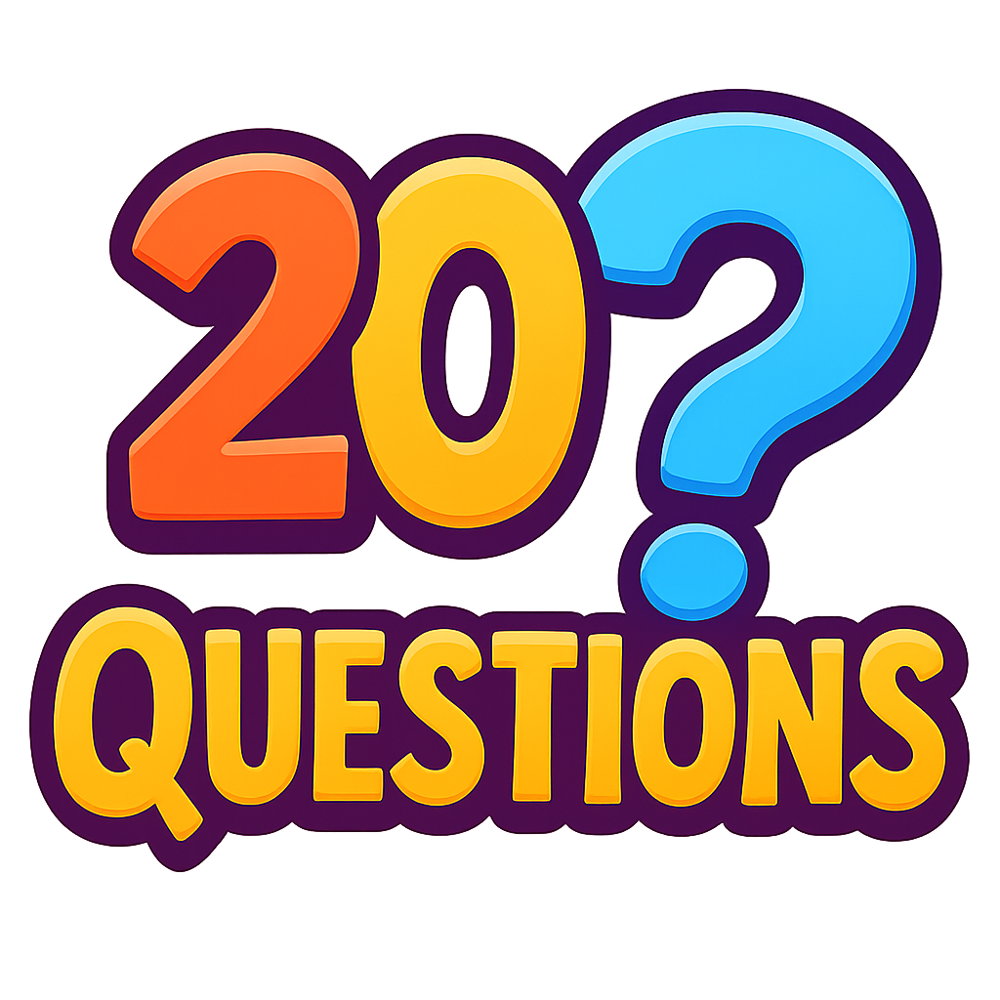<br>
        <sub>20 Questions</sub>
      </td>
      <td align="center" width="110">
        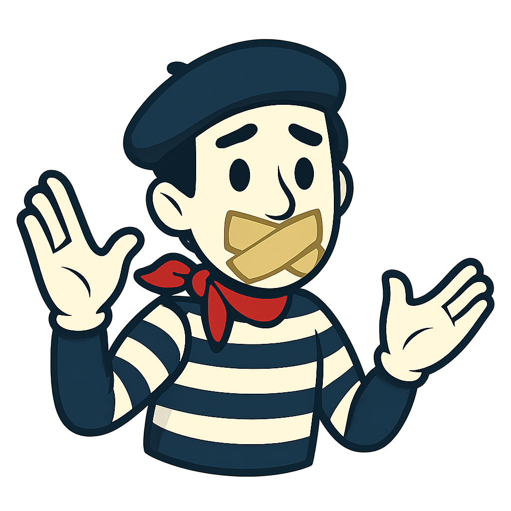<br>
        <sub>Charades</sub>
      </td>
      <td align="center" width="110">
        <br>
        <sub>Hot Potato</sub>
      </td>
      <td align="center" width="110">
        <br>
        <sub>Simon</sub>
      </td>
    </tr>
    <tr>
      <td align="center" width="110">
        <br>
        <sub>Spin the Bottle</sub>
      </td>
      <td align="center" width="110">
        <br>
        <sub>Truth Bombs</sub>
      </td>
      <td align="center" width="110">
        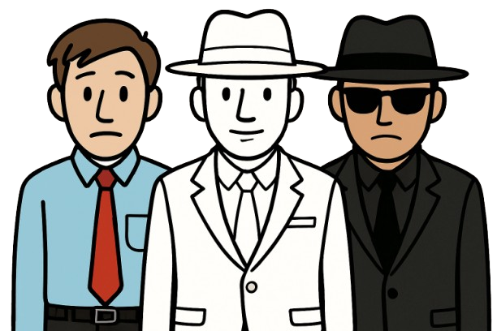<br>
        <sub>Undercover</sub>
      </td>
      <td align="center" width="110">
        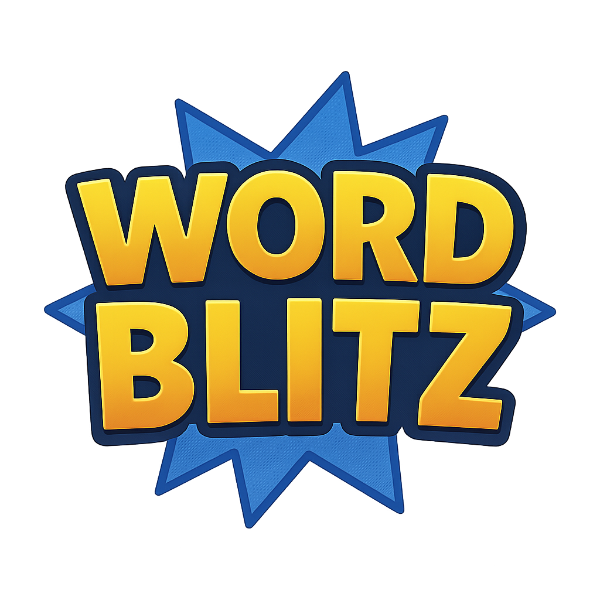<br>
        <sub>Word Blitz</sub>
      </td>
    </tr>
  </table>
</div>

---

### 20 Questions


**Min players:** 2 &nbsp;|&nbsp; **Teams:** No

<br>

One player picks someone from the group to be the chooser. The chooser secretly types a word, name, or description into a popup - nobody else sees it. The rest of the group then takes turns asking yes/no questions. Tap YES or NO to answer and log each response on screen. Any logged answer can be tapped to correct it if you misread something.

The trophy button (top right) ends the round as a win for the group. After 20 questions the round ends automatically regardless of outcome. The report reveals the secret word, the full question log, and declares who won.

**Settings:** Pick the chooser. That is the only setting.

---

### Charades


**Min players:** 4 &nbsp;|&nbsp; **Teams:** Yes (2 teams)

<br>

Players split into two teams. The active player gets a word and has to act it out - no speaking, no mouthing, no spelling, no pointing at things in the room. Teammates shout guesses freely until someone gets it or time runs out.

Before each turn, the active player picks one of three words from a difficulty-tiered selection: Easy (+1 pt), Medium (+2 pts), or Hard (+3 pts). If **Manual Word Selection** is enabled, the opposing team types a secret word instead.

Mid-turn controls: **Peek** pauses the timer and shows the word privately. **Found** (with confirmation) scores the point. **Give Up** (with confirmation) ends the turn at zero. After every turn, a popup shows the word before handing off to the next team.

**Settings:** Rename teams, move players between teams, choose categories, toggle Manual Word Selection, set timer (30 s – 3 min), set number of rounds. Language switcher in the top bar.

**Report:** Per-team, per-round scores with point values. All words listed - guessed and skipped - with a screenshot button.

---

### Hot Potato


**Min players:** 2 &nbsp;|&nbsp; **Teams:** No

<br>

A hidden timer counts down in the background. Nobody knows when it will go off. Players swipe the phone left or right to pass it around - a ticking beep starts at 5 seconds. Whoever is holding the phone when the timer hits zero is eliminated.

After each elimination, a popup lets you adjust the timer duration for the next round. The game continues until one player survives. Suggested word categories are shown in settings as inspiration - while passing the phone, players can shout a word from the category, making it feel like a hot-seat quiz as well as a reaction game.

**Settings:** Timer duration (30 – 300 s). Suggested categories listed for reference.

**Report:** Elimination order by round. The final survivor is the winner.

---

### Simon


**Min players:** 1 &nbsp;|&nbsp; **Teams:** No

<br>

Four colored buttons arranged in a cross pattern light up one at a time. Watch the sequence, then tap the buttons back in the same order. Get it right and one more button is added. Get it wrong and your turn ends - your score is how many steps you completed before the mistake.

Each player plays every round independently. Sequences reset between players and at the start of each new round. With multiple players, a popup announces whose turn it is before each attempt.

**Settings:** Number of rounds (1 – 10).

**Report:** Level reached per player per round. Highest cumulative score wins.

---

### Spin the Bottle


**Min players:** 3 &nbsp;|&nbsp; **Teams:** No

<br>

The bottle animation selects a random asker. The player on the opposite side is the target. Two choices appear: **Spin Again?** to re-roll the asker, or **Go** to accept the pairing and move to the action phase.

Once you tap Go, two new options appear: **Vote to Eliminate** opens a group vote to potentially remove the target from the game, or **Next Round** skips the vote and advances. Eliminated players are removed from all future rounds. The game ends when the round limit is reached or one player remains.

**Settings:** Maximum rounds (1 – 20).

**Report:** Every pairing listed by round with vote results and eliminations. Survivors shown at the end.

---

### Truth Bombs


**Min players:** 3 &nbsp;|&nbsp; **Teams:** No

<br>

A question appears on screen - things like "most likely to forget someone's name" or "who would last the longest in the wilderness." Every player in the group must receive at least some votes before the round can advance. Use the + and − buttons next to each name to distribute. The total votes assigned must equal the number of players exactly - no more, no less.

Once the votes balance, the **Next** button unlocks. On the last question it becomes **Finish**, which triggers the report.

**Settings:** Number of questions (1 – 20). Questions are drawn randomly from the full bank. Language can be switched mid-game via the translate icon.

**Report:** Vote totals per player per question, with the most-voted player highlighted on each. Screenshot to share.

---

### Undercover


**Min players:** 4 &nbsp;|&nbsp; **Teams:** Hidden (roles)

<br>

Three roles, one secret each. **Civilians** all share the same word. The **Undercover** gets a closely related but different word. **Mr. White** gets nothing at all.

Each player privately taps Reveal on their turn to see their role. Then in turns, each player says one word that is loosely related to theirs - vague enough not to expose their role, specific enough that their fellow civilians understand. After everyone speaks, the group votes to eliminate the most suspicious player.

<table>
  <tr>
    <td align="center" width="90">
      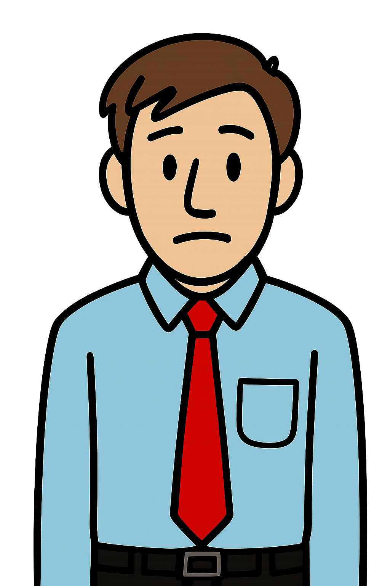<br>
      <sub>Civilian</sub>
    </td>
    <td align="center" width="90">
      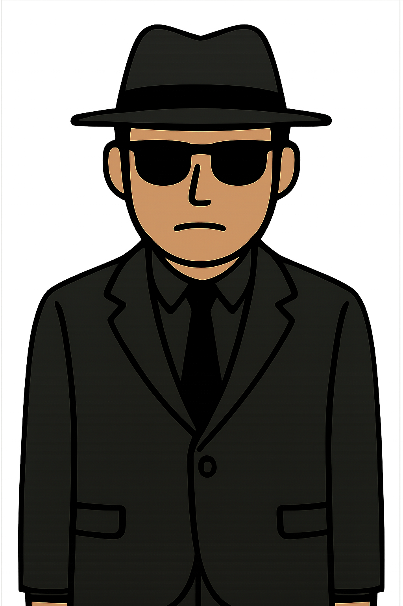<br>
      <sub>Undercover</sub>
    </td>
    <td align="center" width="90">
      <br>
      <sub>Mr. White</sub>
    </td>
  </tr>
</table>

Win conditions: Civilians win by eliminating all undercovers and Mr. White. Mr. White gets one last chance after being voted out - correctly guess the civilian word and steal the win. The undercover wins by surviving long enough to outnumber the civilians.

**Type in words** toggle (on by default): each player types their spoken word into the app before the cycle begins. This creates a paper trail for the report. Turning it off speeds up play and runs on trust.

**Settings:** Role counts (auto or custom via toggle). Type in words toggle.

**Report:** Each player's role and the words that were in play. When Type in words is on, each cycle shows what every player said alongside their vote count. When it's off, cycles show names and votes only.

---

### Word Blitz


**Min players:** 4 &nbsp;|&nbsp; **Teams:** Yes (2 teams)

<br>

Three rounds, three completely different rules for giving clues. The same 35-word pack is used across all rounds - words that get guessed are removed, so the pack shrinks as the game progresses.

| Round | Rule |
|---|---|
| 1 - Describe | Say anything. Use as many words as you want. |
| 2 - One Word | A single word. That is all you get. |
| 3 - Mime | No words. Gestures and sounds only. |

The active player sees the current word and taps **Got it!** when their team guesses correctly (removes the word from the pack) or **Skip** to cycle to the next word (skipped words come back around). Score as many as possible before the timer runs out. Teams alternate turns. After both teams play a turn, the round advances.

The translate icon switches the word pack language mid-game.

**Settings:** Rename teams, swap players between teams, timer per turn (30 – 90 s). Language switcher in the top bar.

**Report:** Team scores broken down by round and clue style. Guessed and skipped words listed separately.

---

## Reports & Screenshots

Every game ends on a report screen. Reports show the full record of the session - scores, questions asked, words guessed, votes cast, roles revealed, depending on the game.

All report screens include a **Take Screenshot** button that saves a captured image of the report directly to the device gallery. This uses the `screenshot` and `image_gallery_saver_plus` packages and requires gallery write permission on older Android versions.

---

## Building for Release

### Prerequisites

- Flutter SDK (tested on 3.38.x)
- Android SDK
- A release keystore (see below)

### Signing setup

Generate a keystore once:

```bash
keytool -genkey -v \
  -keystore android/app/upload-keystore.jks \
  -alias upload \
  -keyalg RSA -keysize 2048 -validity 10000
```

Create `android/key.properties` (already in `.gitignore`):

```
storePassword=your_password
keyPassword=your_password
keyAlias=upload
storeFile=upload-keystore.jks
```

### Build

```bash
# Android App Bundle (for Play Store)
flutter build appbundle --release

# APK (for direct install)
flutter build apk --release
```

Output: `build/app/outputs/bundle/release/app-release.aab`

---

## Screenshots

<div align="center">
  <table>
    <tr>
      <td align="center">
        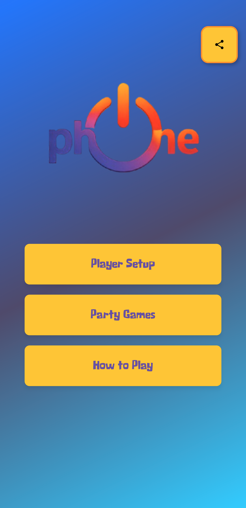<br>
        <sub>Main Menu</sub>
      </td>
      <td align="center">
        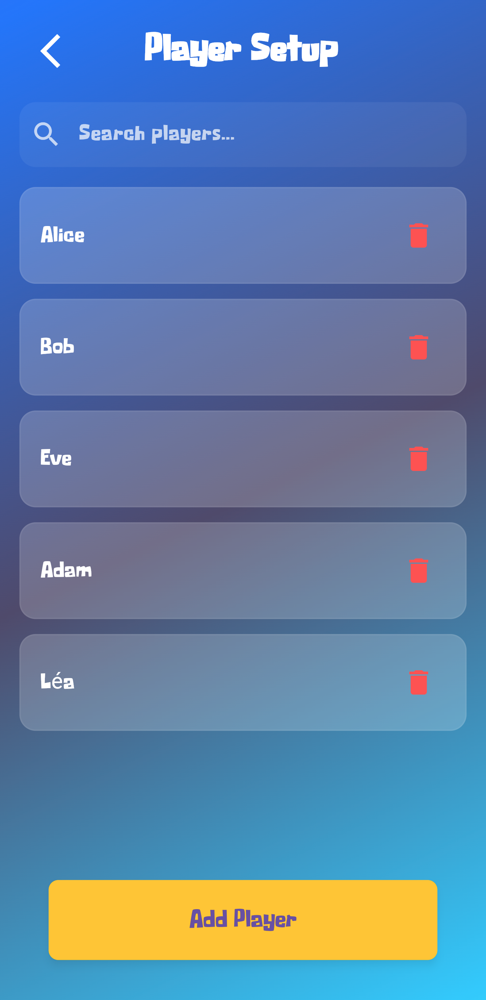<br>
        <sub>Player Setup</sub>
      </td>
      <td align="center">
        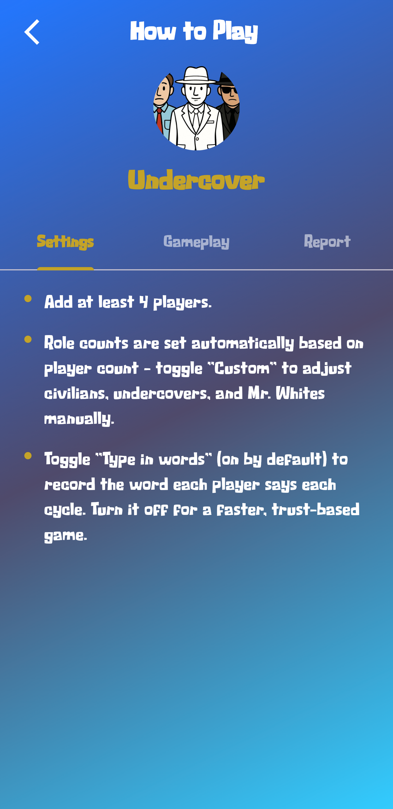<br>
        <sub>How to Play</sub>
      </td>
      <td align="center">
        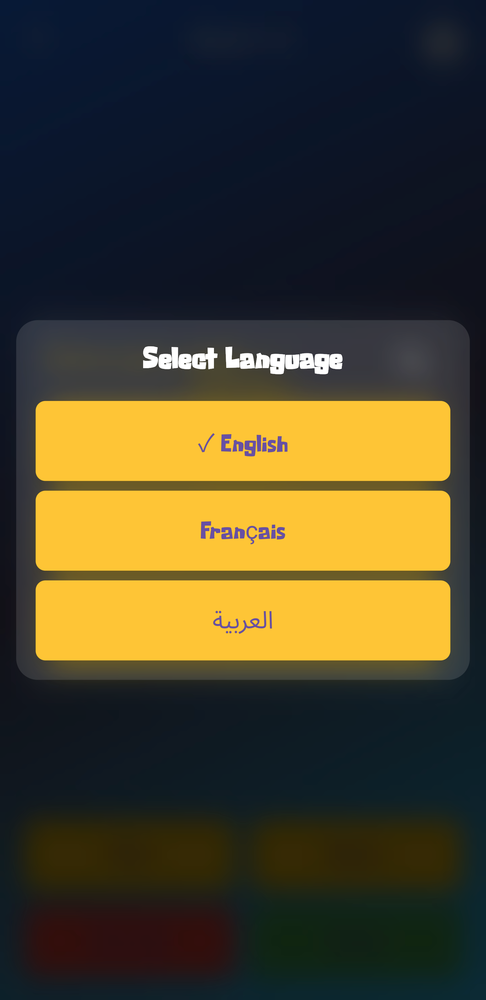<br>
        <sub>Language Selection</sub>
      </td>
    </tr>
    <tr>
      <td align="center">
        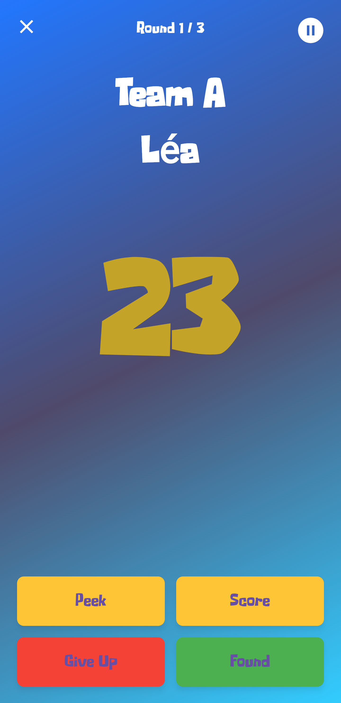<br>
        <sub>Charades</sub>
      </td>
      <td align="center">
        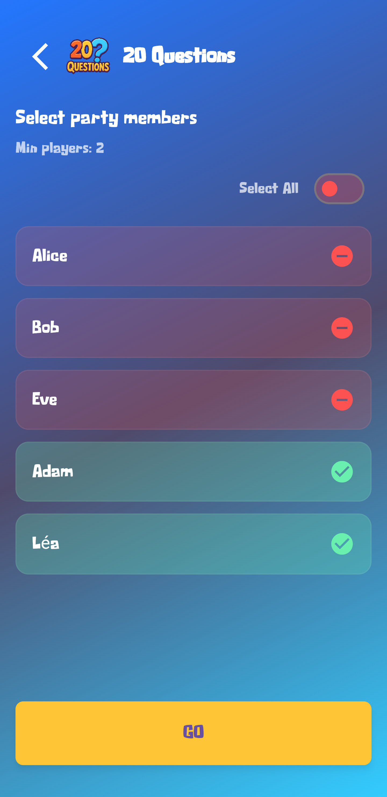<br>
        <sub>20 Questions — Chooser</sub>
      </td>
      <td align="center">
        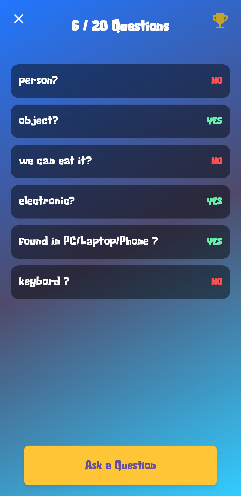<br>
        <sub>20 Questions — Active</sub>
      </td>
      <td align="center">
        <br>
        <sub>20 Questions — Report</sub>
      </td>
    </tr>
    <tr>
      <td align="center">
        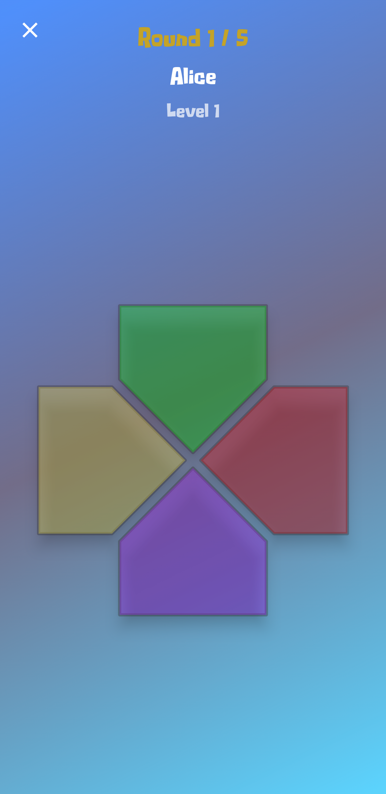<br>
        <sub>Simon</sub>
      </td>
      <td align="center">
        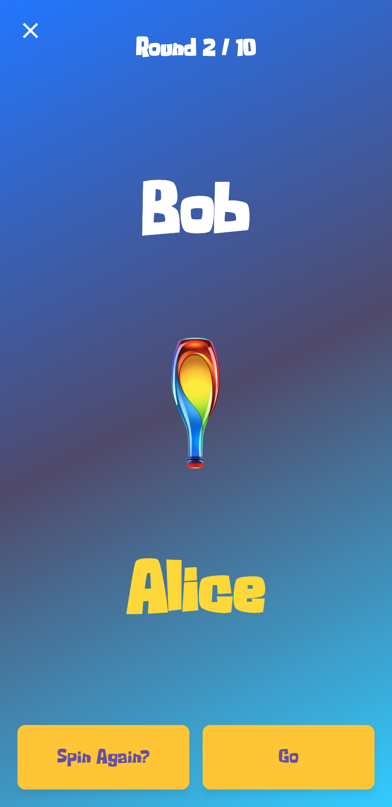<br>
        <sub>Spin the Bottle</sub>
      </td>
      <td align="center">
        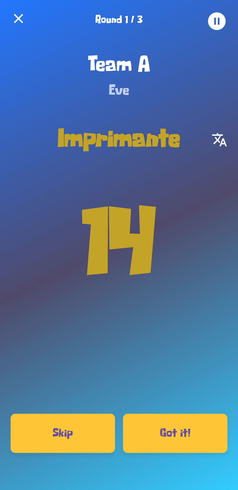<br>
        <sub>Word Blitz (French)</sub>
      </td>
      <td align="center">
        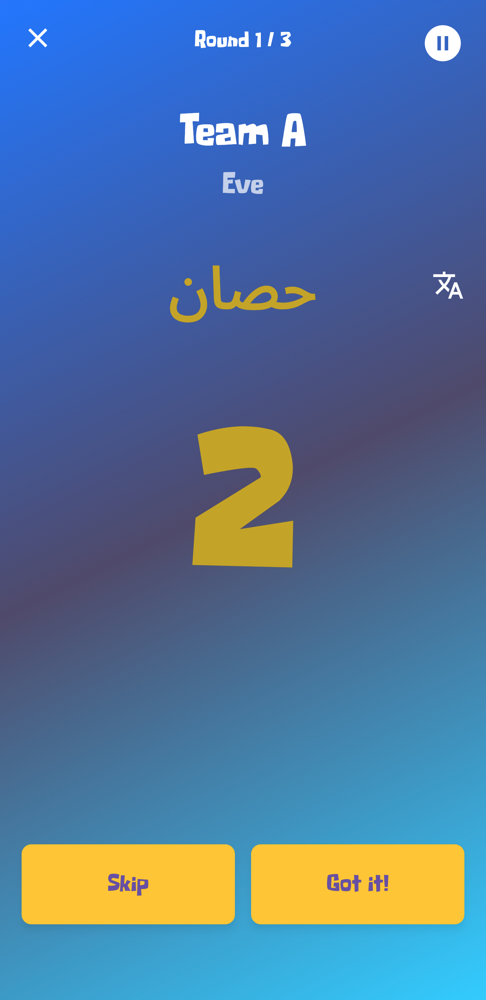<br>
        <sub>Word Blitz (Arabic)</sub>
      </td>
    </tr>
  </table>
</div>

---

## Privacy

No data leaves the device. Player names are stored locally in SharedPreferences and can be deleted from within the app. No analytics, no accounts, no network calls.

Full policy: [PRIVACY_POLICY.md](PRIVACY_POLICY.md)

---

## License

MIT License - Copyright (c) 2026 Rami Younes

Permission is hereby granted, free of charge, to any person obtaining a copy of this software to use, copy, modify, merge, publish, distribute, sublicense, and/or sell copies of it, subject to the standard MIT terms.
